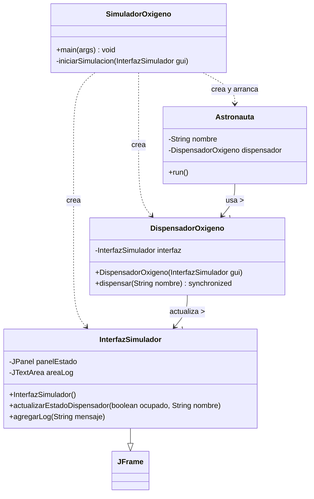
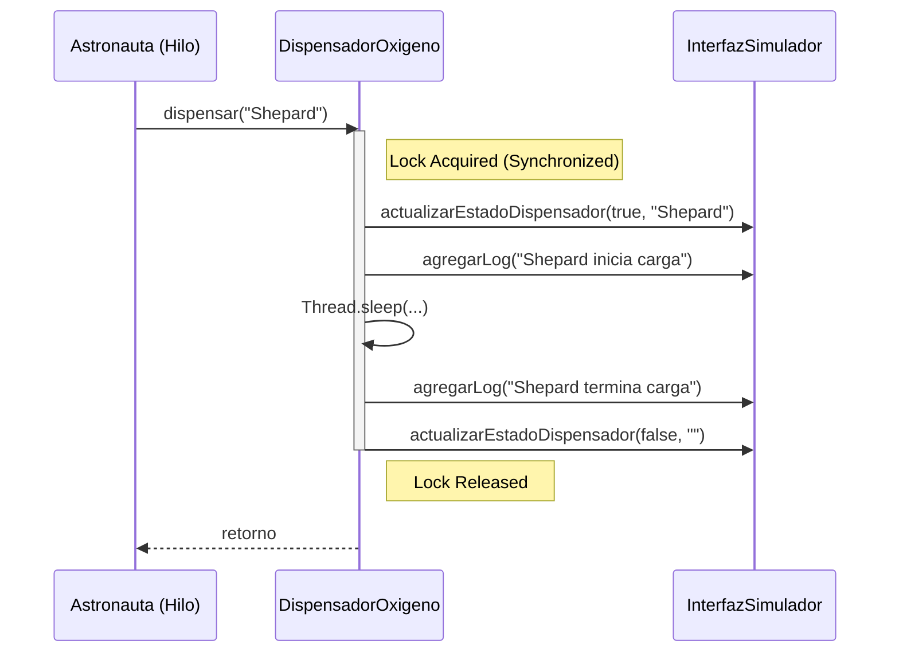
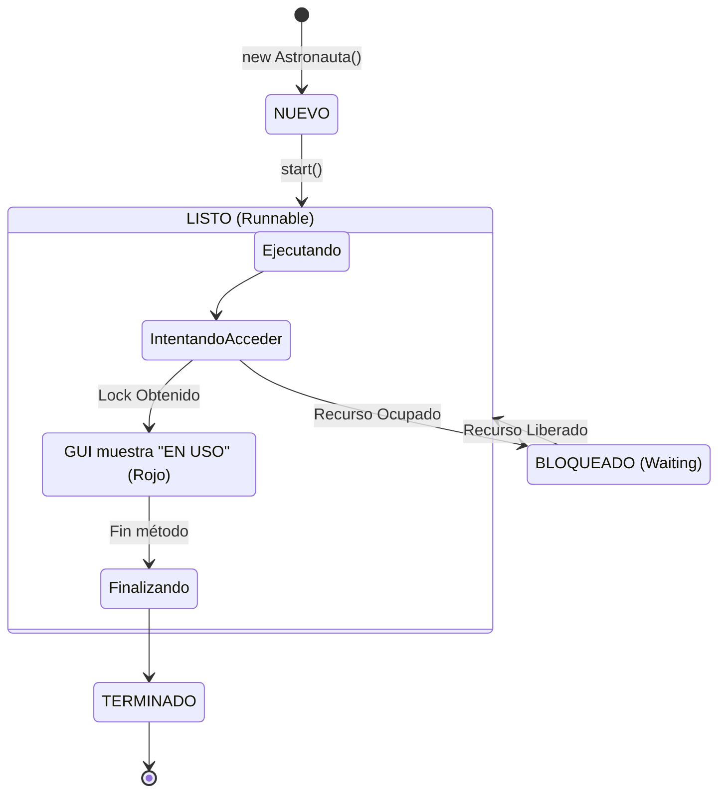

# Simulador de Dispensador de Oxígeno

Este proyecto es una simulación en Java que demuestra conceptos fundamentales de sistemas operativos y programación concurrente, específicamente el manejo de recursos compartidos y exclusión mutua.

## Contexto de la Simulación

En una estación orbital, el suministro de oxígeno es crítico. Las cápsulas de oxígeno solo pueden ser dispensadas a un astronauta a la vez. Cuando múltiples astronautas necesitan recargar sus tanques simultáneamente, deben coordinarse para esperar su turno y acceder al recurso vital de manera ordenada y segura, evitando conflictos o condiciones de carrera.

## Conceptos Clave

*   **Acceso Exclusivo:** Garantizar que solo un hilo (astronauta) pueda acceder al recurso crítico (dispensador) en un momento dado.
*   **Sincronización:** Coordinación entre múltiples hilos para mantener la consistencia del sistema.
*   **Concurrencia Segura:** Ejecución simultánea de tareas sin errores derivados de la manipulación compartida de datos.

## Estructura del Proyecto

*   `SimuladorOxigeno.java`: Clase principal (Main) que inicia la simulación y la interfaz gráfica.
*   `InterfazSimulador.java`: Maneja la interfaz gráfica de usuario (GUI) para visualizar el estado de los astronautas y el dispensador.
*   `Astronauta.java`: Representa un hilo de ejecución (Thread) que simula a un miembro de la tripulación.
*   `DispensadorOxigeno.java`: El recurso compartido (Monitor) que gestiona el acceso sincronizado.

## Diagramas Técnicos (Implementación GUI)

### 1. Diagrama de Clases (UML)

Muestra la estructura de clases, incluyendo la integración de `InterfazSimulador`.



### 2. Diagrama de Secuencia

Ilustra la interacción entre el hilo `Astronauta`, el monitor `DispensadorOxigeno` y la actualización de la `InterfazSimulador`.



### 3. Diagrama de Estados del Hilo (Astronauta)

Describe el ciclo de vida del hilo `Astronauta` y su relación con el estado visual en la GUI.



## Requisitos

*   Java Development Kit (JDK) 8 o superior.

## Cómo Ejecutar

1.  **Compilar el código source:**
    
    Abre una terminal en la carpeta del proyecto y ejecuta:

    ```bash
    javac *.java
    ```

2.  **Iniciar la simulación:**

    Ejecuta la clase principal:

    ```bash
    java SimuladorOxigeno
    ```

La aplicación lanzará una ventana donde podrás observar el registro de actividades y el estado de los astronautas en tiempo real.
